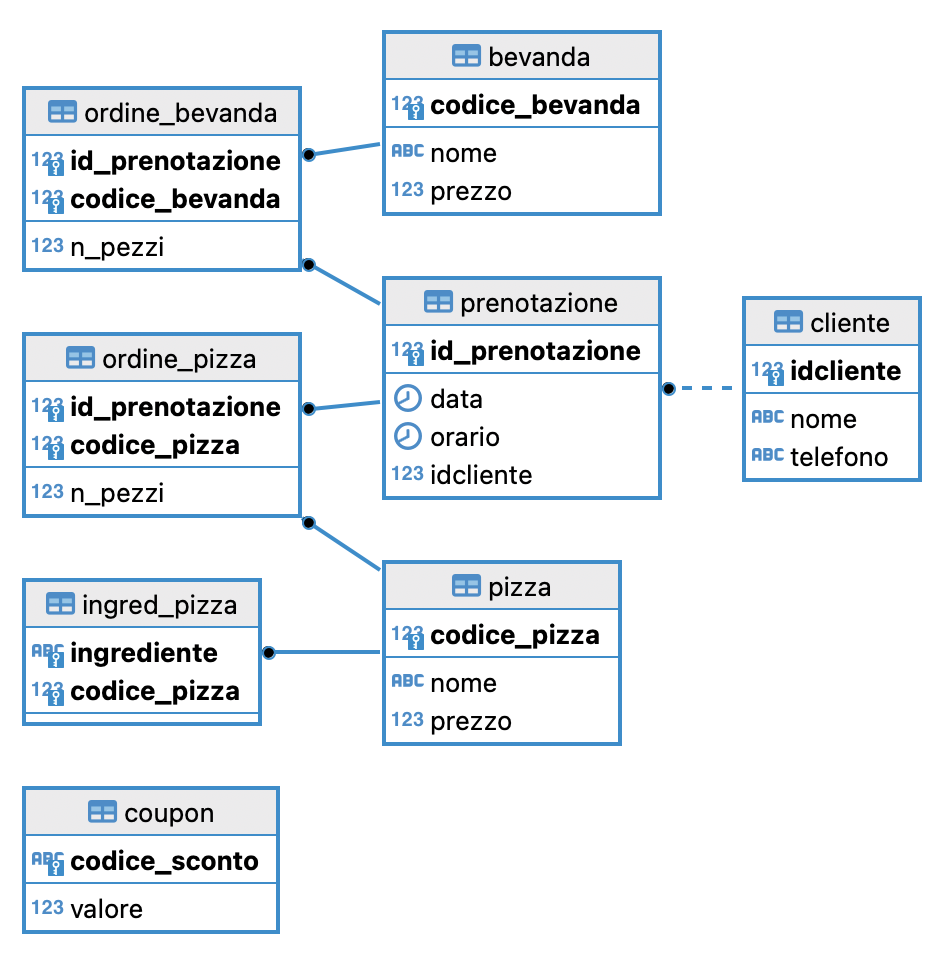
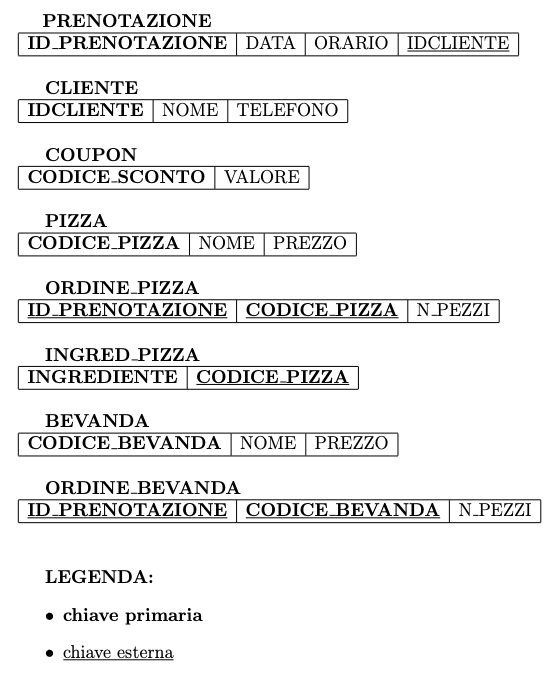
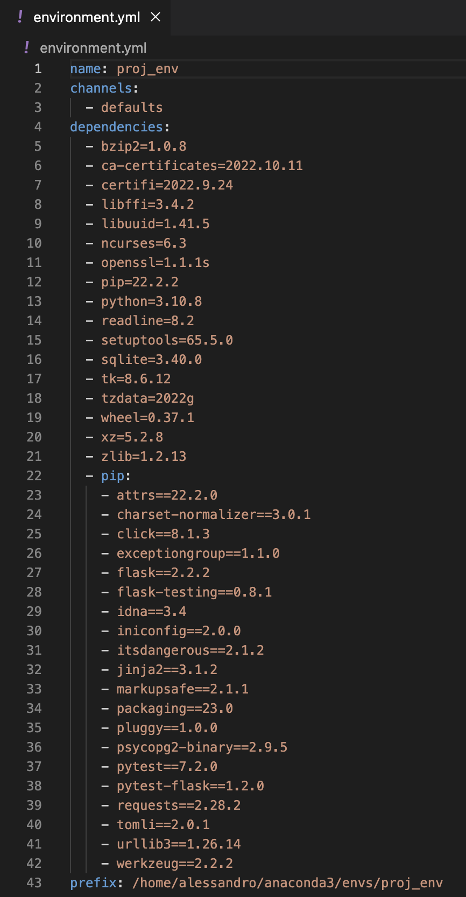
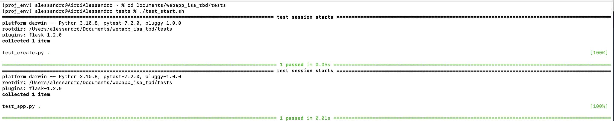
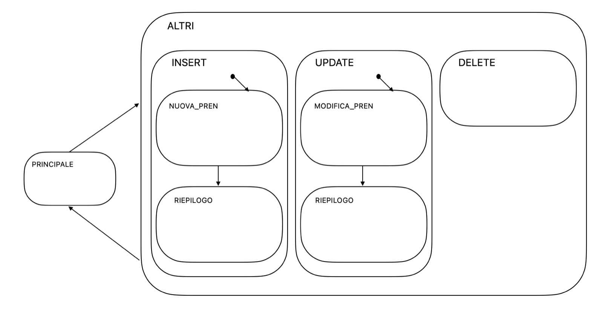

# PIZZApp
Questa repository contiene i file per lo sviluppo di un'applicazione web che gestisce le prenotazioni di una pizzeria.

Questo README fornisce un'illustrazione generale di questo progetto, ed è diviso nelle seguenti sezioni:
- [Introduzione](#introduzione)
- [Repository overview](#repository-overview)
- [Descrizione del database](#descrizione-del-database)
- [Gestione delle dipendenze](#gestione-delle-dipendenze)
- [Framework di test](#framework-di-test)
- [Statechart](#statechart)

## Introduzione
Lo sviluppo di questo progetto è finalizzato al soddisfacimento dei requisiti richiesti per quanto concerne i corsi di Ingegneria del Software Avanzata e di Tecnologie per le Basi di Dati.

I requisiti specifici richiesti per Tecnologie per le basi di dati sono:
- realizzazione di un’applicazione che utilizza un database,
- utilizzo di linguaggio di programmazione a scelta,
- presentazione dello schema logico del database,
- il database deve contenere almeno 5 tabelle,
- l’applicazione deve fare operazioni di INSERT, UPDATE, DELETE e almeno un JOIN,
- il DBMS deve essere SQL Server, Oracle, DB2 o postgres (non si può utilizzare mySQL o Access).

L’applicazione da me sviluppata è una web app Flask che si interfaccia con un database postgres per gestire le prenotazioni di una pizzeria. Tramite essa infatti, un cliente potrà visualizzare il menu della pizzeria, effettuare le proprie prenotazioni, modificarle o eliminarle.
Ho utilizzato _psycopg2_ per realizzare la connessione tra la web app Flask (sviluppata in python con l’utilizzo di html, css e javascript lato web) e il database postgres.
Inoltre ho utilizzato _DBeaver_ come strumento di amministrazione database.

Per quanto riguarda Ingegneria del Software Avanzata, il progetto ha lo scopo di verificare la capacità di condurre un progetto software utilizzando le tecniche e gli strumenti proposti nel corso, con conseguenti sviluppo e discussione del progetto.
Per l’integrazione di questi requisiti nel mio progetto ho quindi utilizzato:
- **Git, GitHub, GitKraken**: per il controllo di versione,
- **conda**: package manager open source (utilizzato per la gestione delle dipendenze),
- **pytest-flask**: framework di test per la creazione di una suite di test automatizzati.

## Repository overview
La repository è organizzata del modo seguente:

## Descrizione del database
La base di dati PIZZERIA tiene traccia di tutte le prenotazioni di una pizzeria per asporto, dei menu delle pizze e delle bevande, dei clienti e dei coupon (buoni sconto) messi a disposizione dalla pizzeria.

Ogni prenotazione ha un codice univoco, un cliente associato, un orario di riferimento e la lista dei codici dei prodotti (pizze e bevande) desiderati.
I prodotti sono di due tipi: pizze o bevande.
Ogni pizza ha un codice univoco, un nome, (la lista di ingredienti) e un prezzo. Ogni bevanda ha un codice univoco, un nome e un prezzo.
Ogni cliente è identificato da un ID cliente univoco che sarà associato al nome e, in modo facoltativo, al numero di telefono del cliente.
Inoltre la pizzeria in particolari occasioni rilascia dei coupon a qualche cliente permettendogli di avere diversi tipi di sconto.
Ogni coupon ha un codice univoco identificativo e un valore in euro pari al valore dello sconto applicabile (chiaramente dopo essere stato utilizzato viene eliminato dal database, i coupon non sono cumulabili).

### Schema ER normalizzato

### Schema relazionale normalizzato in terza forma normale (3NF)

## Gestione delle dipendenze
Per quanto riguarda la gestione delle dipendenze ho utilizzato *conda*, un package manager open source che consente di installare, eseguire e aggiornare rapidamente pacchetti e relative dipendenze tramite l'utilizzo di ambienti virtuali.

Per quest'applicazione tutte le dipendenze sono racchiuse all'interno dell'ambiente virtuale conda *proj_env*, di cui riporto l'estrazione tramite il file [environment.yml](./environment.yml).

## Framework di test
Per sviluppare una suite di test automatizzati ho utilizzato la libreria *pytest-flask*.

Come si può notare dalla struttura della repository, tutti i file di test sono, come indicato dalle best practice, organizzati nella cartella [tests](./tests/) in questo modo:
- [conftest.py](./tests/conftest.py): configurazione iniziale che permette, tramite database URI, la connessione al database per l’esecuzione dei test,
- [test_app.py](./tests/test_app.py): test che verifica la corretta connessione al database,
- [test_create.py](./tests/test_create.py): test che verifica il corretto funzionamento della funzione `create()`. Ho impostato dei dati di test e il test client per testare la richiesta HTTP POST al fine di controllare che le prenotazioni vengano inserite correttamente all’interno del database,
- [test_start.sh](./tests/test_start.sh): script bash per avviare automaticamente i test inserendo le variabili globali d’ambiente per connettersi al database.

## Statechart
Di seguito è riportato lo statechart relativo al funzionamento della web app **PIZZApp**.

